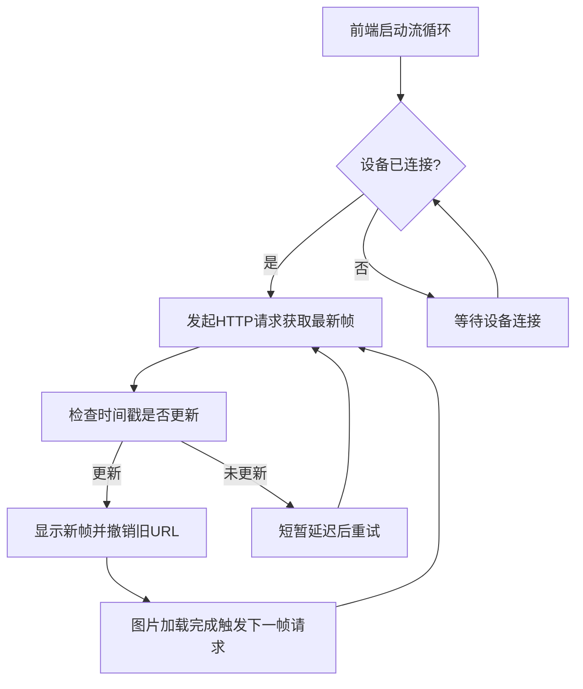

## 1. 产品概述
Open-AutoGLM GUI屏幕流式传输功能，提供实时设备屏幕镜像。采用HTTP轮询机制替代WebSocket推送，实现"显示后获取下一帧"的流量控制，移除预加载机制，优化带宽使用和系统性能。

## 2. 核心功能

### 2.1 用户角色
| 角色 | 注册方式 | 核心权限 |
|------|----------|----------|
| 普通用户 | 本地访问 | 查看设备屏幕、调整流质量、控制设备 |

### 2.2 功能模块
屏幕流式传输功能包含以下核心模块：

1. **屏幕镜像页面**: 实时设备屏幕显示、流质量选择、FPS监控
2. **流控制设置**: 质量设置(360P-1080P)、最大宽度限制、帧率控制

### 2.3 页面详情
| 页面名称 | 模块名称 | 功能描述 |
|----------|----------|----------|
| 屏幕镜像 | 设备屏幕显示 | 显示最新帧图片，支持点击交互，响应式布局适配横竖屏 |
| 屏幕镜像 | 流质量选择器 | 提供360P、480P、720P、1080P、自动五种质量选项 |
| 屏幕镜像 | FPS监控 | 实时显示当前流帧率，基于时间戳计算 |
| 屏幕镜像 | 加载状态 | 无可用帧时显示加载动画和提示信息 |

## 3. 核心流程

### 3.1 HTTP轮询流程

### 3.2 流量控制机制
- **并发控制**: 限制同时只有一个活跃的HTTP请求
- **时间戳验证**: 通过X-Timestamp头确保只显示更新的帧
- **错误重试**: 请求失败时采用指数退避策略
- **链式触发**: 当前帧加载完成后立即触发下一帧请求

## 4. 用户界面设计

### 4.1 设计规范
- **主色调**: 深色主题(#0f1115背景，#161b22侧边栏)
- **强调色**: 蓝色系(#3b82f6, #58a6ff)
- **状态色**: 绿色(#10b981)、红色(#ef4444)、灰色(#6b7280)
- **字体**: 等宽字体用于技术信息，系统字体用于UI文本
- **动画**: 微妙的过渡效果和加载动画

### 4.2 页面布局
| 模块名称 | UI元素 |
|----------|--------|
| 设备屏幕显示 | 圆角手机框架，黑色边框，响应式宽高比(9:19.5或19.5:9) |
| 流质量选择器 | 下拉菜单，显示当前质量和标签 |
| FPS监控 | 小型标签，显示实时计算的帧率 |
| 加载状态 | 居中旋转动画，灰色设备图标，提示文字 |

### 4.3 响应式设计
- **桌面优先**: 固定400px宽度的侧边屏幕镜像区域
- **移动端适配**: 支持触摸交互，适配不同屏幕尺寸
- **横竖屏检测**: 自动识别并调整显示比例

## 5. 技术规范

### 5.1 性能要求
- **帧率**: 目标30FPS，实际根据设备性能自适应
- **延迟**: 端到端延迟小于200ms
- **带宽**: 360P质量下约200-500KB/s，1080P下约1-2MB/s
- **内存**: 无预加载，内存占用最小化

### 5.2 质量控制
- **图片格式**: JPEG，质量参数可调(50-80)
- **尺寸限制**: 最大宽度360-1080px，保持原始宽高比
- **缓存策略**: 无客户端缓存，每帧都是最新数据
- **错误处理**: 网络异常时自动重试，设备断开时暂停

### 5.3 交互体验
- **点击反馈**: 蓝色波纹效果，持续500ms
- **加载感知**: 明确的加载状态指示
- **质量切换**: 即时生效，无感知切换
- **连接状态**: 实时显示设备连接状态