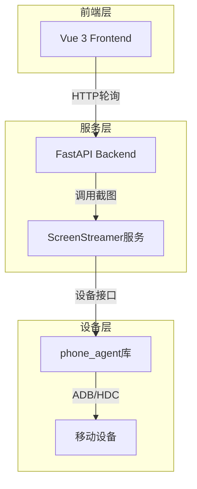

## 1. 架构设计



## 2. 技术描述

### 前端技术栈
- **框架**: Vue 3 + TypeScript
- **构建工具**: Vite
- **UI库**: Element Plus + Tailwind CSS
- **状态管理**: Pinia
- **HTTP客户端**: Axios

### 后端技术栈
- **框架**: FastAPI (Python)
- **异步处理**: asyncio
- **设备接口**: phone_agent库
- **图像处理**: Pillow (可选)

## 3. API定义

### 3.1 屏幕流API

**获取最新帧**
```
GET /control/stream/latest
```

响应:
- **状态码**: 200 (成功), 404 (无可用帧)
- **Content-Type**: image/jpeg
- **Headers**:
  - `X-Timestamp`: 帧时间戳(毫秒)
  - `Cache-Control`: no-cache

**更新流设置**
```
POST /control/stream/settings
```

请求体:
```json
{
  "quality": 50,
  "max_width": 360,
  "fps": 30
}
```

## 4. 数据模型

### 4.1 前端状态模型
```typescript
interface StreamState {
  latestScreenshot: string // blob URL
  lastFrameTs: number
  isFetchingFrame: boolean
  isStreaming: boolean
  fps: number
  streamQuality: string
}
```

### 4.2 后端服务模型
```python
class ScreenStreamer:
    latest_frame: Optional[bytes]
    latest_frame_ts: float
    quality: int = 50
    max_width: int = 540
    fps: float = 30.0
    is_streaming: bool = False
```

## 5. 轮询机制实现

### 5.1 前端轮询逻辑
```typescript
// 并发控制
let activeRequests = 0
const MAX_CONCURRENT_REQUESTS = 1

// 链式触发机制
const tryFetchFrame = async () => {
  if (activeRequests >= MAX_CONCURRENT_REQUESTS) return
  activeRequests++
  
  try {
    const response = await fetch('/api/control/stream/latest')
    if (response.ok) {
      const tsHeader = response.headers.get('X-Timestamp')
      const currentTs = tsHeader ? parseInt(tsHeader, 10) : Date.now()
      
      // 时间戳验证
      if (currentTs > lastFrameTs.value) {
        lastFrameTs.value = currentTs
        const blob = await response.blob()
        const url = URL.createObjectURL(blob)
        
        // 清理旧URL
        if (latestScreenshot.value && latestScreenshot.value.startsWith('blob:')) {
          URL.revokeObjectURL(latestScreenshot.value)
        }
        
        latestScreenshot.value = url
        
        // 链式触发：图片加载完成后请求下一帧
        const img = new Image()
        img.onload = () => {
          if (isStreaming.value && activeDeviceId.value) {
            setTimeout(() => tryFetchFrame(), 0)
          }
        }
        img.src = url
      } else {
        // 无新帧，短暂延迟后重试
        if (isStreaming.value) {
          setTimeout(() => tryFetchFrame(), 10)
        }
      }
    }
  } catch (e) {
    // 错误重试
    if (isStreaming.value) {
      setTimeout(() => tryFetchFrame(), 200)
    }
  } finally {
    activeRequests--
  }
}
```

### 5.2 后端流服务
```python
class ScreenStreamer:
    def _stream_loop(self):
        target_interval = 1.0 / self.fps
        
        while not self.stop_event.is_set():
            start_time = time.time()
            try:
                device_id = device_manager.active_device_id
                if device_id:
                    factory = get_device_factory()
                    screenshot = factory.get_screenshot(
                        device_id, 
                        quality=self.quality, 
                        max_width=self.max_width,
                        timeout=2  # 短超时防止阻塞
                    )
                    
                    if screenshot and screenshot.jpeg_data:
                        self.latest_frame = screenshot.jpeg_data
                        self.latest_frame_ts = time.time()
                        # 不再广播，前端通过轮询获取
                
                # 动态FPS调整
                elapsed = time.time() - start_time
                if elapsed < target_interval:
                    time.sleep(target_interval - elapsed)
                else:
                    time.sleep(0.001)  # 让出CPU
                    
            except Exception as e:
                time.sleep(0.1)  # 错误退避
```

## 6. 性能优化

### 6.1 前端优化
- **URL清理**: 及时撤销旧的blob URL防止内存泄漏
- **并发控制**: 限制同时只有一个HTTP请求
- **智能重试**: 根据错误类型调整重试间隔
- **时间戳验证**: 避免显示重复帧

### 6.2 后端优化
- **异步截图**: 使用短超时防止阻塞
- **动态FPS**: 根据截图耗时自动调整帧率
- **质量自适应**: 支持多种质量和尺寸设置
- **错误处理**: 健壮的错误捕获和恢复

### 6.3 网络优化
- **无预加载**: 按需获取，减少带宽浪费
- **缓存控制**: 使用no-cache头确保获取最新数据
- **压缩优化**: JPEG质量可调，平衡清晰度和大小
- **连接复用**: HTTP/2连接复用减少开销

## 7. 错误处理

### 7.1 前端错误处理
- **网络错误**: 自动重连，指数退避
- **设备断开**: 暂停轮询，等待设备重新连接
- **图像加载失败**: 清理错误URL，继续轮询
- **内存管理**: 及时清理blob URL和事件监听器

### 7.2 后端错误处理
- **设备异常**: 捕获设备连接错误，不影响其他功能
- **截图超时**: 短超时设置，防止服务阻塞
- **资源清理**: 确保流服务正确停止和清理
- **日志记录**: 记录关键错误信息便于调试